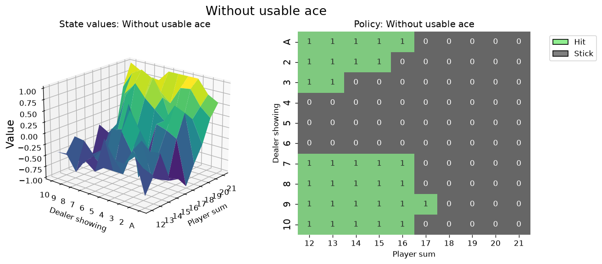
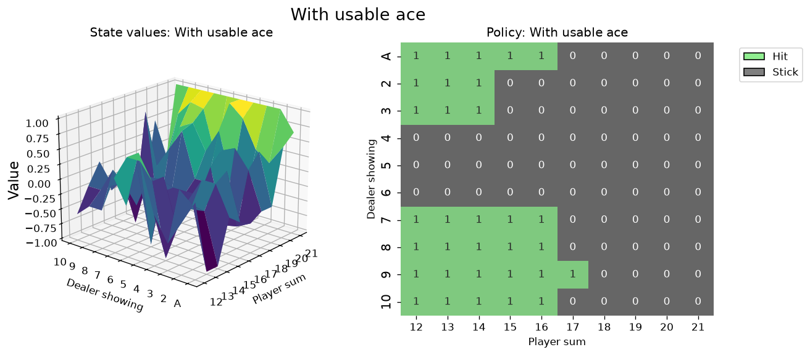

# Testing TypeSafe Jev on Blackjack: Can a Decision Model Play Without the Rules?

Most language models make decisions by generating text. You send a prompt, wait for tokens to stream back, parse the output as JSON, and hope the model did not add explanatory chatter that breaks your parser.

TypeSafe Jev takes a different route. It is built as a decision primitive through OpenRouter's Decisions API. Instead of prompting for text, you pass structured state alongside candidate choices. The model returns the chosen action, a probability distribution over the choices, and a confidence score.

To see how well this works on an actual control problem, we hooked Jev up to Gymnasium's standard `Blackjack-v1` environment under Sutton and Barto rules. 

We also gave it a handicap: zero rules in the prompt.

We did not explain that the goal is 21. We did not explain that going over 21 is a bust, or that the dealer must hit until 17. The prompt contained only:

```json
{
  "instructions": "Choose the action.",
  "criteria": {
    "stand": "stand",
    "hit": "hit"
  }
}
```

The state passed to Jev was just the observation tuple from Gymnasium:

```json
{
  "player_sum": 16,
  "dealer_showing": "10",
  "usable_ace": false
}
```

The question was simple: does Jev carry enough pre-trained knowledge about Blackjack to play reasonable basic strategy on state alone, and what does its confidence look like when the decision is close?

---

## Why a stratified grid instead of random deals

If you deal 100 or even 500 hands randomly, you get an incomplete picture of a policy. 

In standard Blackjack, certain hands happen constantly. You will see hard 20 against a dealer 10 dozens of times. But soft hands (hands where an Ace counts as 11 without busting) are much rarer. A specific hand like soft 12 against a dealer 3 appears only once in roughly 2,200 deals. 

A random sample leaves huge white patches across the policy map. 

To evaluate Jev fairly across every corner of the game, we set up a stratified grid:
- 10 player totals: 12 through 21
- 10 dealer showing cards: Ace through 10
- 2 hand types: without a usable ace (hard totals) and with a usable ace (soft totals)

This creates 200 distinct game situations. We initialized the environment into each exact situation and ran it 5 times with different random dealer hole cards and deck draws. That gave us 1,000 completed hands and 1,341 total player decisions.

---

## The numbers

Here is the high-level summary across all 1,000 games:

| Metric | Measured value |
| --- | --- |
| Total hands simulated | 1,000 |
| Total player decisions | 1,341 |
| Overall record (W / L / P) | 464 wins, 444 losses, 92 pushes |
| Win / loss / push rate | 46.4% / 44.4% / 9.2% |
| Mean return per hand | +0.020 ± 0.030 |
| Basic strategy agreement | 83.7% (1,122 of 1,341 decisions) |
| Median turn latency (p50) | 414.7 ms |
| 90th percentile latency (p90) | 503.6 ms |
| 95th percentile latency (p95) | 541.7 ms |
| Total API cost (all 1,000 hands) | $0.01859 |
| Average cost per decision | $0.0000139 |

Even with no rule descriptions in the prompt, Jev matched textbook basic strategy on 83.7% of all turns. The positive sample return (+0.020) reflects the fact that our stratified grid evenly tests strong hands (like 20 and 21) as often as weak hands (like 12 and 13), rather than weighting by natural deal frequency.

---

## Hard totals: near-textbook play

The policy map for hard totals shows that Jev understands the core mechanics of dealer bust probability.



In the chart above, light green represents hitting (action 1) and dark grey represents standing (action 0).

Notice the rectangular block between dealer cards 4, 5, and 6:
- For player totals 12 through 21 against dealer 4, 5, and 6, Jev stood every single time.
- Against strong dealer upcards (7, 8, 9, 10, and Ace), Jev hit on player totals 12 through 16, and stood on 17 through 21.

This is exactly how basic strategy tells a human to play. When the dealer shows a bust card (4, 5, or 6), you stop taking cards on anything 12 or higher and let the dealer take the risk of busting. When the dealer shows a high card, you accept the risk of busting your own hand because the dealer is likely to make 17 or better. 

Jev followed this logic consistently without ever being told that the dealer draws to 17.

---

## Soft totals: where the abstraction breaks

The policy map for soft hands tells a different story.



When holding a usable ace, textbook basic strategy is aggressive. Because an ace can drop from 11 to 1 without busting the hand, hitting a soft 17 or soft 18 is a free roll to improve your score. Basic strategy says you should hit soft 17 against every dealer upcard.

Jev did not do that. Instead, it stood on soft 17 and soft 18 across multiple dealer cards, especially when the dealer showed 4, 5, or 6.

This makes sense once you look at what the model was given. We passed `{"player_sum": 17, "usable_ace": true}`, but we never defined what `usable_ace` means in the prompt. To a model evaluating the raw number 17, standing against a dealer 5 looks like standard defensive play. 

This highlights an important lesson for using decision models: if an environment abstraction hides the underlying mechanics, the model will fall back on the most salient feature (here, the total of 17). Supplying either the card values (e.g. Ace + 6) or a one-line explanation of the usable ace rule would likely resolve the discrepancy.

---

## Calibration on the razor edge

One of the main arguments for calibrated decision heads is that they should express uncertainty when a call is close. 

A classic edge case in Blackjack is hard 15 against a dealer 2:
- Hitting carries a 46% chance of busting immediately.
- Standing leaves you with a weak total against a dealer who only busts about 35% of the time.
- Basic strategy recommends standing, but the expected values of hitting and standing are separated by less than two cents on the dollar.

Whenever this situation came up in the simulation, Jev did not emit an overconfident choice. On episode 55, for example, Jev returned:
- `probabilities`: `{"hit": 0.50, "stand": 0.50}`
- `confidence`: `0.00`

Across the repeated visits to hard 15 vs 2, confidence stayed below 0.15. In contrast, on obvious stands like hard 20 vs 6, Jev returned confidence scores above 0.85 with stand probabilities exceeding 90%.

The model was not just making choices; its internal confidence tracked the difficulty of the state.

---

## Latency and cost in practice

Running automated control loops against web APIs is usually limited by two factors: latency and price.

For 1,341 sequential API calls from a standard Python script:
- **Median latency:** 414.7 ms per turn.
- **Tail latency:** 503.6 ms at p90, and 541.7 ms at p95.
- **Total bill:** $0.01859 for all 1,000 hands.
- **Per-decision cost:** roughly $0.0000139.

A response time of 400 ms is too slow for high-frequency physics engines, but it is well within the acceptable window for turn-based gameplay, automated workflow triage, customer routing, or async agent loops. 

Because the model only takes in structured state and returns fixed fields, input token counts are tiny (around 330 tokens per turn) and output tokens are minimal (about 31 tokens per turn). Running a million decisions at this volume would cost roughly $14.

---

## Summary

Putting Jev on Blackjack without rule explanations showed three clear things:

1. **Latent game knowledge:** Jev already knows standard Blackjack mechanics well enough to achieve 83.7% agreement with basic strategy on pure state inputs.
2. **Context gaps matter:** When you compress cards into an abstract sum like `usable_ace: true`, the model defaults to treating high numbers as made hands, causing it to stand on soft 17.
3. **Calibrated hesitation:** When the math is razor thin (hard 15 vs 2), the model's confidence drops to near zero rather than faking certainty.

For developers building agent workflows or game logic, this kind of typed decision primitive is much easier to manage than prompting an autoregressive LLM to output markdown or raw JSON. It never hallucinated an invalid action, it never broke schema, and running a thousand complete games cost less than two cents.
