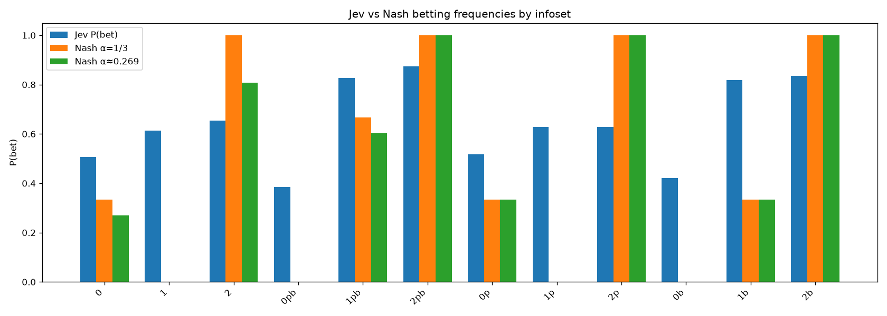
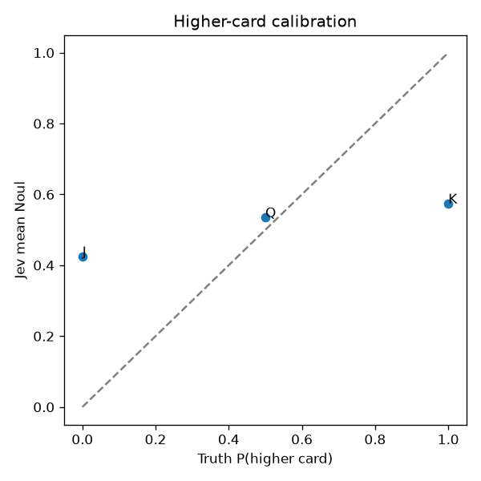

# Jev on Kuhn Poker: results

Run 22 September 2026. Model `typesafe/jev-1.13` through the OpenRouter Decisions API. Code is in `src/kuhn_lab/`. Raw data and charts are in `results/kuhn_*`. The interactive page is `results/kuhn.html`.

## Short answer

Jev knows roughly which cards are strong, but it does not play Kuhn Poker well. It loses about 0.13 chips per hand as the first player and about 0.08 as the second player against a perfect (Nash) opponent. A perfect player loses only 0.056 as first player and wins 0.056 as second. Its biggest mistakes are the ones any beginner avoids: it sometimes calls with the Jack, which can never win, and sometimes folds the King, which can never lose.

## The game

Three cards: J, Q, K. Each player puts in 1 chip and gets one card. The first player checks or bets 1 chip. The second player then checks or bets (after a check), or folds or calls (after a bet). If the first player checked and then faces a bet, they fold or call. Higher card wins at showdown.

The whole game has only 12 decision points: 3 cards times 4 betting situations. That is why this test can be exact. We asked Jev about every one of the 12 situations, 10 times each, and got its full probability for each action. That table is Jev's complete strategy. OpenSpiel then computes, with no randomness, how much a perfect opponent could win against it.

## What we did

1. **Probe.** 120 calls: all 12 situations, 10 times each. The full rules were in the question instructions. The state held only facts: your card, betting so far, pot size, chips to call. The option names match the situation ("check / bet" or "fold / call").
2. **Score exactly.** Built Jev's strategy table from the probe and measured it with OpenSpiel.
3. **Play.** 1,800 hands against a hard-coded Nash opponent: 300 hands for each of 3 Nash variants (alpha = 0, 1/6, 1/3) times 2 seats. Jev's action was **sampled** from its probabilities, not the top choice, because good Kuhn play requires mixing.

Two extra yes/no questions rode along free in every call: "Is your card the higher one?" and, when facing a bet, "Is the opponent bluffing?"

## Results

### Headline numbers

| Measure | Value |
| --- | --- |
| Exploitability (how much a perfect opponent wins per hand, averaged over seats) | **0.22 chips** |
| Same for a perfect player | 0 |
| Same for a coin-flip player | 0.46 |
| Jev's expected result vs Nash, first seat | −0.129 chips/hand (Nash itself: −0.056) |
| Jev's expected result vs Nash, second seat | −0.070 to −0.083 (Nash itself: +0.056) |
| Realized in 1,800 hands, first seat | −0.171 ± 0.048 |
| Realized in 1,800 hands, second seat | −0.074 ± 0.047 |
| Latency per decision | 429 ms median, 516 ms p90 |
| Cost of the 1,800 played hands | $0.049 for 1,966 Jev decisions (the 120 probe calls add a few tenths of a cent) |

So Jev sits about halfway between perfect play and random play.

### Jev's strategy, situation by situation

"P(bet)" means the probability of bet (or call, when facing a bet).

| Situation | Card | Jev | Nash | Comment |
| --- | --- | --- | --- | --- |
| First to act | J | 0.51 | 0 to 0.33 | Bluffs too much |
| First to act | Q | 0.61 | 0 | Should always check |
| First to act | K | 0.65 | 0 to 1 | Within range |
| Checked, then facing a bet | J | 0.38 | 0 | Calls with a hand that cannot win |
| Checked, then facing a bet | Q | 0.83 | 0.33 to 0.67 | Calls too much |
| Checked, then facing a bet | K | 0.87 | 1 | Folds a hand that cannot lose 13% of the time |
| Opponent checked | J | 0.52 | 0.33 | Bluffs too much |
| Opponent checked | Q | 0.63 | 0 | Should always check |
| Opponent checked | K | 0.63 | 1 | Should always bet |
| Opponent bet | J | 0.42 | 0 | Calls with a hand that cannot win |
| Opponent bet | Q | 0.82 | 0.33 | Calls too much |
| Opponent bet | K | 0.84 | 1 | Folds a hand that cannot lose 16% of the time |



The pattern: when no bet is live, Jev bets 50–65% of the time with any card. The card barely changes the answer. When facing a bet, it does rank the cards (J lowest, K highest), but it stays too close to a coin flip at both ends.

### The yes/no side questions

"Is your card the higher of the two?" The true answer is 0% for J, 50% for Q, 100% for K. Jev said 43%, 54%, 57%. It barely separates the Jack from the King.



"Is the opponent bluffing?" Jev answered about 50% in every situation. The question gave no useful signal.

### Confidence

Jev's confidence tracked the same weakness. On the first decision with a Jack it was 0.04, almost zero. It was highest (0.65–0.73) when facing a bet with a Queen or King. It is low where it plays worst, which is honest, but the low confidence came with bad decisions, not careful mixing.

## Is the measurement sound?

Yes. The checks that would catch a broken pipeline all passed:

- The Nash opponent measures as exactly 0 exploitable, and its game value is exactly −1/18, for all three alpha values.
- A fake probe built from the Nash table measures as 0 exploitable and recovers alpha = 1/3.
- Jev gave the same answers in play as in the probe. Its betting probabilities in live play were within 0.01 of the probe averages in every situation. Repeated identical calls varied by only 0.04 to 0.13.
- Realized results match the exact predictions. Pooled over seats, first seat is 0.9 standard errors from the prediction and second seat is 0.1. One of the six single configurations (alpha 1/3, first seat) is 2.3 standard errors off, which is within normal chance for six comparisons.

## Top choice instead of sampling

We did not run this with the API, but we can compute it from the same table. Taking Jev's top choice gives: always bet, call with Q or K, fold J. That is more exploitable (0.33 instead of 0.22) because it never mixes. Against this particular Nash opponent it does better, though: −0.111 as first player and +0.056 as second, because Nash is built to be safe, not to punish mistakes. So Jev's top choice is a better practical policy than its probabilities, but its probabilities are closer to equilibrium.

## Compared with Blackjack

In Blackjack, with no rules at all, Jev agreed with basic strategy 84% of the time. In Kuhn Poker, with full rules, it plays much worse. Blackjack is everywhere in text and a one-player decision against fixed dealer rules. Kuhn Poker is an academic game where good play depends on reasoning about what the other player holds and how often to bluff. That matches TypeSafe's own limits: Jev makes fast snap judgments, and it is weak at multi-step reasoning and numbers.

## Fixes made while checking

- The exact value for Jev in the second seat was read from the wrong player, so it showed Nash's result (+0.07) instead of Jev's (−0.07). Fixed in `metrics.py`. All numbers above use the fixed version.
- The "overall" row in `kuhn_summary.json` compared all hands to the first configuration's prediction. That field is now empty for the overall row.
- The first full run stopped on a 30-second network timeout after 1,316 hands. The rest were added with the same seeding, and the timeout is now 60 seconds. Each of the six configurations has exactly 300 hands.

## How to rerun

```bash
kuhn-lab probe --reps 10
kuhn-lab play --hands 300 --all-configs
kuhn-lab metrics
kuhn-lab analyze
kuhn-lab report
```

## Ideas for a next run

- Give the state the card's rank as a number or a plain phrase ("your card is the highest card in the deck") and see if the King and Jack mistakes go away.
- Ask a narrower question, for example a Noul "Can your card win at showdown?", and apply the obvious rules (always call with K, never with J) in code. This follows TypeSafe's advice to keep logic in code and use Jev for the judgment.
- Run the top-choice version live to confirm the computed numbers.
